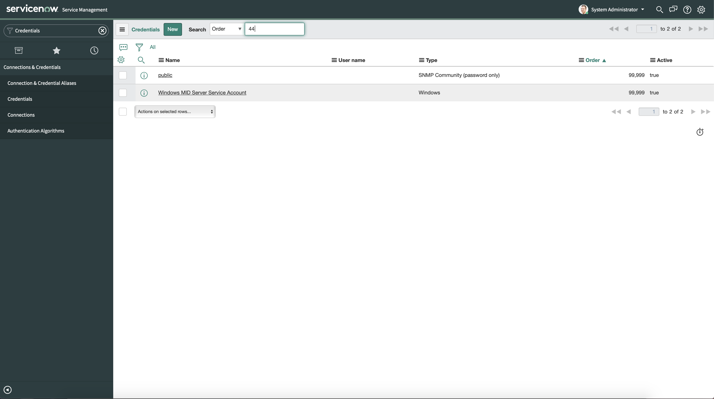
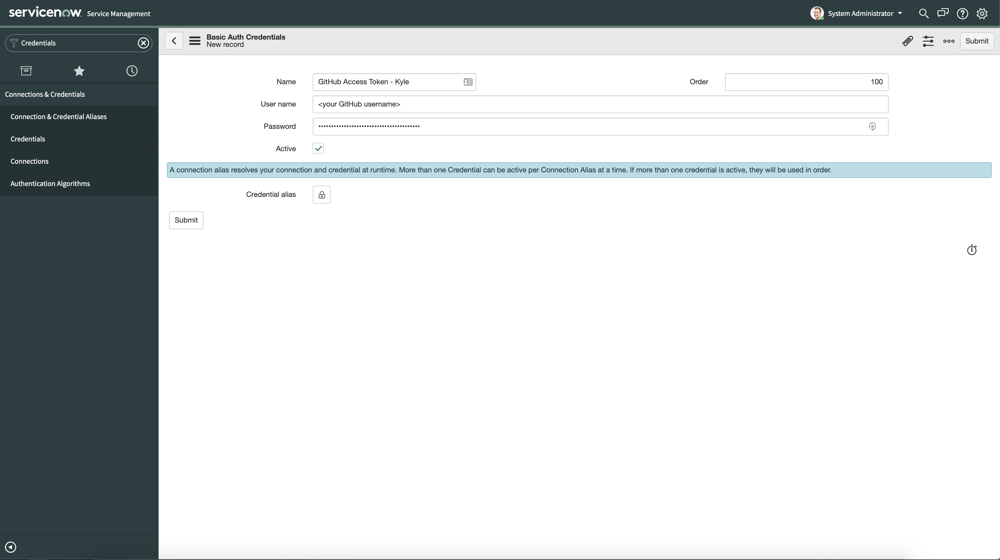
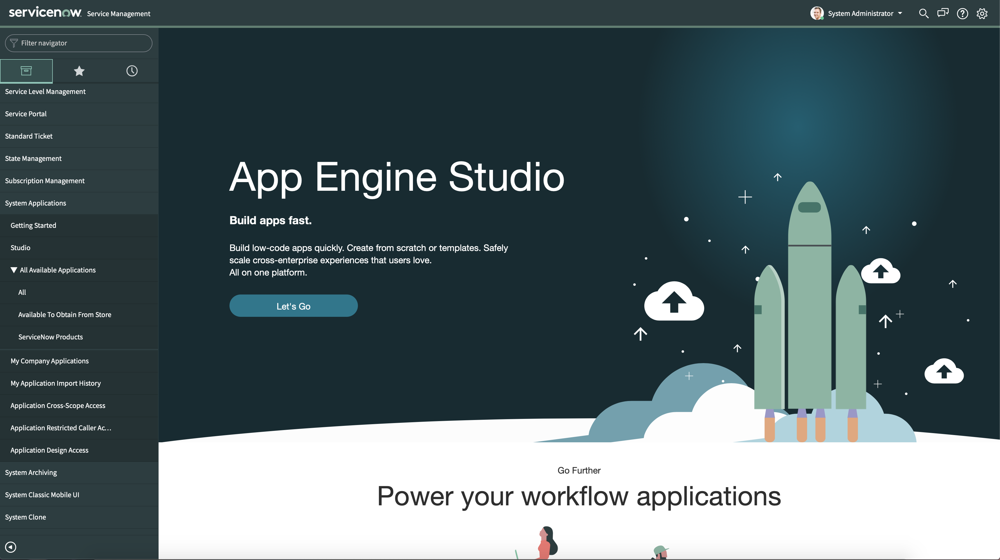
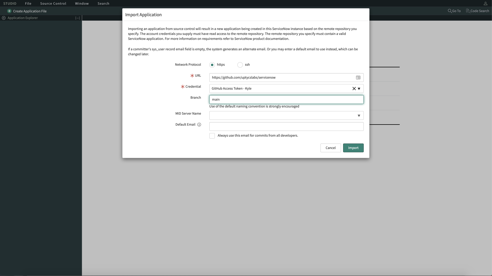
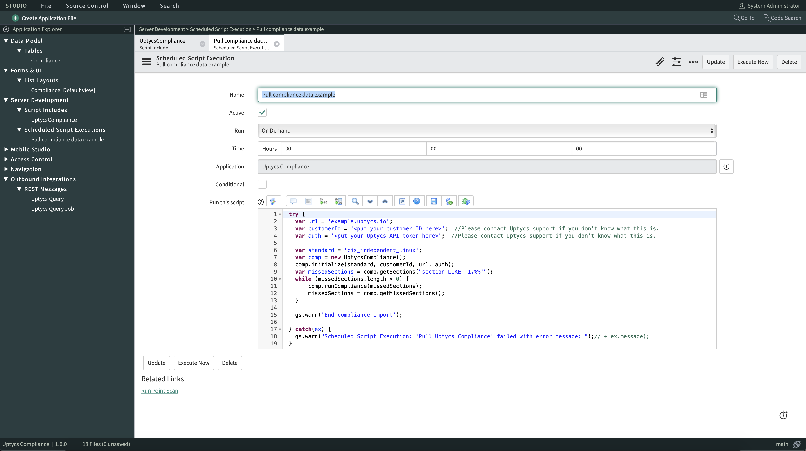

# ServiceNow Compliance Integration
An application to assist with pulling large amounts of compliance data from Uptycs.

# Installation

First, you will need to fork the repository and give yourself read-write access.  Then, navigate to your ServiceNow instance and create the appropriate credential.  To do so:
  - Type "credentials" in the filter navigator of your ServiceNow instance and navigate to the credentials table.  Click the 'New' button and then the 'Basic Auth Credentials' link.  
  
  
  
  - For this application, all that is necessary to fill in is the 'Name' and the 'User name'.  You will fill in the 'Password' field if you want to make your fork private.  'Name' is a name you choose to find the credential in the credentials table, 'User name' is your github account user name. If you wish to make your fork of the repository private, you will need to crate an authorization token to fill in the password field of your 'credential' to pull the repository.

  


  - Next, navigate to the ServiceNow Studio by typing "studio" in the filter navigator.
  
  

  - The app studio will open in a new tab where a window will pop up prompting you to select an application.  There is a button labelled 'Import From Source Control'.  Click it and you will be brought to a page where you can type in the URL for the application you want (in this case, the URL leading to your forked repository).  Fill in the URL and select the credential you just created from the drop down menu.  The branch name is main.  Click 'Import' and the application will be imported. You will now be able to install the app from the list of available of applications.

  


# Usage

Once the application is installed, you will have access to the Compliance Script Include.  This is a class of methods to assist in pulling the compliance data.  There is also an example Scheduled Script Execution called "Pull compliance data example".



In this Scheduled Script Execution, you will need to fill in url, customerId, auth, standard, and missedSections.  The meaning of these variables is as follows:
  **url** - the url for your Uptycs instance (ex. kyle.uptycs.io)

  **customerId** - the customerId for your Uptycs instance, this can be found in the api key file generated on your Uptycs instance

  **auth** - the authorization token generated from the key and secret found in the api key file generated on your Uptycs instance, a short python script to generate the authorization can be found below.

  **standard** - the compliance standard you want to pull data for, this will be unique to the compliance configuration chosen in the Uptycs UI (ex. cis_independent_linux)
  
  **missedSections** - a clause to be added to the SQL query used to pull compliance data, to pull all sections use "section LIKE '%%'"

The Scheduled Script Execution is ready, you can set it to a schduled interval or run it on demand.  All data pulled will end up in the Uptycs Compliance->Compliance table on your ServiceNow instance.

# Token Generation Script
```
#!/usr/bin/python

import sys
import getopt
import json
import jwt

def generate_auth(data, key, secret):
   authVar = jwt.encode({'iss':key},secret)
   authorization="Bearer %s" % (authVar)
   return authorization

def main():
  try:
    opts, args = getopt.getopt(sys.argv[1:], 'f:')
  except getopt.GetoptError as err:
    print(err)
    usage()

  apifile=None

  for o,a in opts:
    if o in ("-f"):
      apifile=a

  data = json.load(open(apifile))

  print(data['customerId'])
  print(generate_auth('' , data['key'], data['secret']));

if __name__ == "__main__":
  main()
```

# Generated files
This repository contains generated files and a checksum.

If you find yourself unable to import your repository due to the presence of files edited outside an instance of ServiceNow, merge commits that mix files from different revisions, or other data that does not match the checksum, you may recover using either of the following techniques:
* Remove the problem commits:
  1. Clone your repository to a personal computer with the git command line tools installed and open a git command prompt in the repository root
  2. Run `git log` and take note of the SHA1s of the problem commits
  3. Build revert commits using `git revert SHA1` repeatedly, working backward in time, for each commit that introduced changes not generated by a ServiceNow instance
  4. Run `git push`

* Overwrite the problem code snapshot with a known good one:
  1. Clone your repository to a personal computer with the git command line tools installed and open a git command prompt in the repository root,
  2. Locate a known good code snapshot and record its SHA1. For this step, `git log` can be useful.
  2. Run `git reset --hard SHA1` to a commit that was generated by a ServiceNow instance
  3. Run `git reset HEAD{1}`
  4. Run `git add -A`
  5. Run `git commit`
  6. Run `git push`

 **Notes on dependencies**
  1. Dependencies will not show up in the list of changes but will be exported/imported
  2. It is your responsibility to resolve the dependencies before installing an application. ServiceNow source control will not manage these for you. In case you installed an application before installing its dependencies:
   2.1 Delete the application
   2.2 Activate/install all required dependencies
   2.3 Re-import the application from source control
   Currently listed dependencies:
   * System Import Sets
